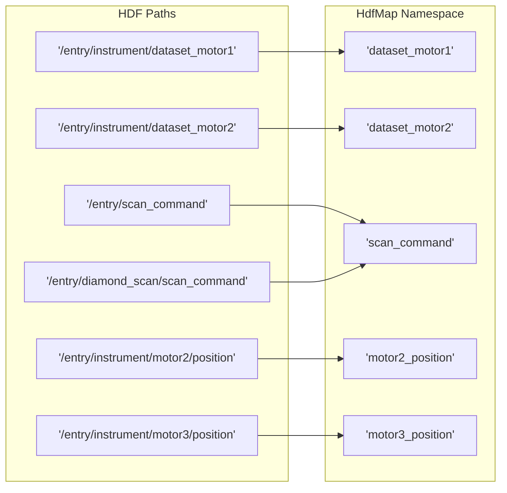
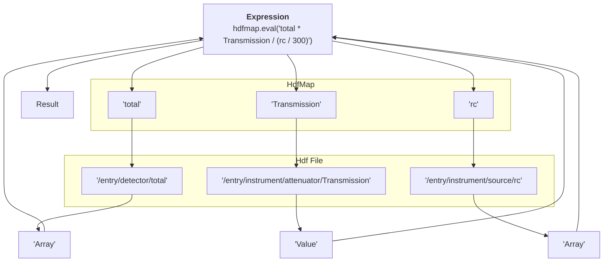

# How it works

## HdfMap namespace

``` mermaid
flowchart LR
    subgraph HDF Paths
    ds1['/entry/instrument/dataset_motor1']
    ds2['/entry/instrument/dataset_motor2']
    ds3['/entry/scan_command']
    ds6['/entry/diamond_scan/scan_command']
    ds4['/entry/instrument/motor2/position']
    ds5['/entry/instrument/motor3/position']
    end
    subgraph HdfMap Namespace
    nm1['dataset_motor1']
    nm2['dataset_motor2']
    nm3['scan_command']
    nm4['motor2_position']
    nm5['motor3_position']
    end
    ds1 --> nm1
    ds2 --> nm2
    ds3 --> nm3
    ds6 --> nm3
    ds4 --> nm4
    ds5 --> nm5
```

## eval expression

```mermaid
flowchart TB
    cmd["`**Expression**
    hdfmap.eval('total * Transmission / (rc / 300)')`"]
    subgraph HdfMap 
        map_total['total']
        map_trans['Transmission']
        map_rc['rc']
    end
    subgraph Hdf File 
        hdf_total['/entry/detector/total']
        hdf_trans['/entry/instrument/attenuator/Transmission']
        hdf_rc['/entry/instrument/source/rc']
    end
    data_total['Array']
    data_trans['Value']
    data_rc['Array']
    result[Result]
    cmd --> map_total
    cmd --> map_trans
    cmd --> map_rc
    map_total --> hdf_total
    map_trans --> hdf_trans
    map_rc --> hdf_rc
    hdf_total --> data_total
    hdf_trans --> data_trans
    hdf_rc --> data_rc
    data_total --> cmd
    data_trans --> cmd
    data_rc --> cmd
    cmd --> result
```